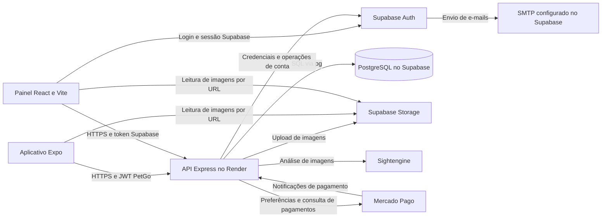

# Arquitetura técnica do PetGo

**Data de referência:** 18 de setembro de 2026.  
**Código de referência:** commit `40e3c655a72bd57eb7a3d2438e82ba2b0cca802a`.  
**Finalidade:** documentar a implementação atual para apoiar a fundamentação técnica e a descrição do desenvolvimento no Trabalho de Conclusão de Curso.

## 1. Visão geral

O PetGo é um sistema voltado ao registro e acompanhamento de animais em situação de vulnerabilidade. A solução reúne um aplicativo para Android e iOS, uma API responsável pelas operações do domínio e um painel administrativo web. Entre as funcionalidades implementadas estão cadastro e autenticação de usuários, visualização geográfica de animais, registro de resgates, recompensas em moedas virtuais, integração de checkout e moderação administrativa.

A organização é cliente-servidor, com separação entre apresentação, processamento das requisições e persistência. O aplicativo e o painel consomem uma API HTTP implementada em Node.js. O Supabase fornece PostgreSQL, autenticação de contas e armazenamento de arquivos. Serviços externos complementam pagamentos, análise de imagens e mapas.

O backend constitui uma única aplicação Express, organizada em módulos de rotas, middlewares e serviços; não há uma arquitetura de microsserviços implementada. O monorepositório reúne três projetos com dependências e execução próprias.

Este documento descreve o comportamento existente. Funcionalidades planejadas e limitações são identificadas separadamente, evitando apresentá-las como recursos concluídos. O esquema completo do banco de produção não está versionado no repositório: a descrição das tabelas distingue evidências do código, migrações disponíveis e informações fornecidas no levantamento do projeto.

## 2. Organização do repositório

```text
tcc2-petgo/
├── app/                         Aplicativo React Native/Expo
│   ├── App.js                   Composição da navegação e deep links
│   ├── app.json                 Configuração básica do Expo
│   ├── app.config.js            Configuração complementar e plugins nativos
│   ├── eas.json                 Perfis de build
│   ├── components/              Componentes, incluindo mapas por plataforma
│   ├── context/AuthContext.js   Estado compartilhado e operações da conta
│   ├── screens/                 Telas do aplicativo
│   └── services/                Requisições autenticadas e localização
├── server/                      API Node.js/Express
│   ├── index.js                 Inicialização e montagem das rotas
│   ├── db.js                    Pool PostgreSQL e adaptador de consultas
│   ├── middleware/              Autorização mobile e administrativa
│   ├── routes/                  Autenticação, animais e administração
│   ├── services/                JWT mobile e moderação automática
│   ├── sql/                     Migrações de autorização administrativa
│   ├── tests/                   Testes automatizados
│   └── SECURITY_ROLLOUT.md      Procedimento de publicação da segurança
├── admin/                       Aplicação web administrativa
│   ├── src/App.jsx              Rotas protegidas e layout
│   ├── src/context/             Estado de autenticação administrativa
│   ├── src/lib/                 Cliente Supabase e cliente HTTP
│   ├── src/pages/               Login, dashboard, usuários e animais
│   ├── src/components/          Componentes compartilhados
│   ├── src/index.css            Estilos globais e Tailwind
│   └── vercel.json              Reescrita das rotas da aplicação web
└── docs/                        Documentação técnica
```

Cada projeto possui seu próprio `package.json` e arquivo de lock. Essa organização permite desenvolver e publicar o backend e o painel separadamente do build mobile. Mudanças no contrato de autenticação, entretanto, exigem coordenação entre as versões da API e do aplicativo.

## 3. Stack tecnológica

As versões abaixo correspondem às declarações dos manifestos do commit de referência. Os arquivos de lock determinam as versões resolvidas em uma instalação reproduzível.

| Camada | Tecnologias declaradas | Responsabilidade |
| --- | --- | --- |
| Aplicativo | React `19.2.3`, React Native `0.86.3`, Expo `~57.0.23` | Interface mobile e acesso a recursos nativos |
| Navegação mobile | React Navigation: native `^7.2.2`, stack `^7.8.9`, bottom-tabs `^7.15.9` | Pilhas de telas, abas e navegação condicional |
| Recursos nativos | Expo Location, Image Picker e File System, série 57 | Localização e manipulação de imagens/arquivos |
| Layout e interação | Safe Area Context `~5.7.0`, Gesture Handler `~2.32.0`, Reanimated `4.5.1`, Screens `~4.26.0` | Áreas seguras e infraestrutura de interação/navegação |
| Mapas | MapLibre React Native `^11.3.10` e React Native Maps `1.27.2` | Renderização geográfica, com implementação por plataforma |
| API | Node.js `22.x`, Express `^5.2.1`, JavaScript CommonJS | Rotas HTTP e processamento das operações |
| Acesso ao banco | `pg` `^8.22.0` | Conexão SQL com PostgreSQL no Supabase |
| Integração Supabase | `@supabase/supabase-js` `^2.115.0` no servidor e no painel | Auth, operações administrativas de identidade e Storage |
| Upload | Multer `^2.3.0` | Recebimento de arquivos multipart em memória |
| Pagamentos | SDK `mercadopago` `^3.2.0` | Criação de preferências e consulta de pagamentos |
| Painel web | React `^19.2.0`, React DOM `^19.2.0`, Vite `^7.0.0` | Aplicação administrativa de página única |
| Rotas web | React Router DOM `^7.0.0` | Navegação do painel |
| Estilização web | Tailwind CSS `^3.4.17`, PostCSS `^8.5.0`, Autoprefixer `^10.4.0` | Estilos utilitários e processamento de CSS |
| Testes | `node:test` e `node:assert/strict` | Verificação de contratos e controles de acesso |
| Infraestrutura | Render, Supabase, GitHub e EAS Build | Hospedagem da API, serviços de dados, versionamento e builds mobile |

O painel possui configuração de rotas para publicação na Vercel. Essa preparação no repositório não comprova que um ambiente público do painel já tenha sido publicado.

## 4. Comunicação entre componentes



As operações de negócio do mobile passam pelo backend. O painel utiliza o Supabase diretamente para autenticação, mas consulta e altera os dados administrativos por meio de `/admin`. Ele não realiza consultas diretas às tabelas de usuários, animais ou permissões administrativas.

O acesso SQL do backend é realizado por `DATABASE_URL`, mediante o pool do pacote `pg`. O SDK Supabase é empregado para Auth e Storage. Portanto, o uso do Supabase não implica que todas as operações de banco sejam feitas pelo SDK ou pela Data API.

## 5. Aplicativo mobile

### 5.1. Interface, navegação e estado

O ponto principal de composição é `app/App.js`. O aplicativo utiliza navegação em pilha para telas de autenticação, redefinição de senha e planos, além de abas para Mapa, Próximos, Resgatados e Conta. A presença de um usuário no contexto determina o conjunto de telas apresentado.

`AuthContext.js` mantém o perfil do usuário e a coleção de animais em memória. Também expõe operações de login, cadastro, recuperação de senha, atualização de perfil e ações relacionadas às moedas. Não há Redux ou persistência local da sessão mobile implementados nessa camada.

O módulo `app/services/mobileApi.js` concentra o envio do token da API. As chamadas públicas de login, cadastro e recuperação continuam utilizando seus endpoints sem exigir esse token. Leituras de imagens locais não são interceptadas pelo cliente autenticado.

### 5.2. Localização e mapas

O aplicativo solicita permissão de localização em primeiro plano por meio do Expo Location. O serviço `location.js` tenta aproveitar a última localização conhecida; quando ela não existe, solicita a posição atual com precisão balanceada e limite de espera de 15 segundos.

A tela de animais próximos calcula distâncias a partir de latitude e longitude no próprio aplicativo, filtra o raio selecionado e ordena os resultados. A API atual fornece a coleção de animais; não há consulta geoespacial paginada implementada no backend.

Os mapas são separados por arquivos de plataforma:

- `PetMap.android.js`: no build nativo utiliza MapLibre, com estilo Liberty hospedado no OpenFreeMap e dados do OpenStreetMap. No Expo Go, há um caminho alternativo com React Native Maps, pois o módulo MapLibre não está incluído naquele cliente.
- `PetMap.ios.js`: utiliza React Native Maps sem especificar o provedor Google.

Essa separação permite compartilhar a interface de seleção de posição e de animais, mantendo implementações adequadas a cada ambiente. O comportamento no Expo Go não representa integralmente o mapa utilizado pelo APK Android.

## 6. Autenticação e autorização mobile

### 6.1. Duas identidades relacionadas

O PetGo distingue a identidade gerenciada pelo Supabase Auth do perfil de domínio armazenado em `public.users`.

O campo `public.users.auth_user_id` relaciona o perfil ao UUID da conta no Supabase Auth. O perfil contém os dados utilizados pelo aplicativo, como nome, moedas e plano. A API emite seu próprio JWT após validar o login; esse token não é o access token do Supabase.

| Característica | Sessão mobile | Sessão administrativa |
| --- | --- | --- |
| Emissor do token usado na API | Backend PetGo | Supabase Auth |
| Identidade principal | ID de `public.users` no claim `sub` | UUID da identidade Supabase |
| Validação | Assinatura JWT e consulta de acesso no banco | `auth.getUser(token)` e associação administrativa |
| Armazenamento no cliente | Memória do aplicativo | Persistência do SDK no navegador |
| Renovação | Não há refresh automático; novo login após expiração | SDK configurado com renovação automática |
| Controle adicional | `petgo_private.user_access` | `petgo_private.admin_users` |

### 6.2. Login e emissão do JWT

O fluxo de login mobile possui as seguintes etapas:

1. O aplicativo envia e-mail e senha a `POST /auth/login` por HTTPS.
2. O backend normaliza o e-mail e procura o perfil por `LOWER(TRIM(email))`, em consulta parametrizada.
3. Consulta o estado de acesso para negar contas banidas.
4. Para contas vinculadas ao Supabase, valida as credenciais por `signInWithPassword`, usando um cliente sem persistência de sessão. Existe também um caminho legado que compara a senha armazenada no perfil quando não há `auth_user_id`; essa compatibilidade não recria nem migra contas.
5. Para o login Supabase bem-sucedido, atualiza o indicador local de confirmação de e-mail.
6. Emite um JWT PetGo e retorna o perfil com o campo `accessToken`.
7. O mobile separa o token do perfil, mantém ambos em memória e passa a acessar as operações protegidas.

O serviço `server/services/mobileSession.js` utiliza o módulo nativo `node:crypto` para assinar tokens com HMAC-SHA256, identificado por `HS256`. A chave é obtida da variável de ambiente `MOBILE_JWT_SECRET`, com exigência de pelo menos 32 bytes. Ela pertence exclusivamente ao backend.

O conteúdo do JWT inclui:

| Claim | Conteúdo |
| --- | --- |
| `iss` | Emissor fixo `petgo-api` |
| `aud` | Público-alvo fixo `petgo-mobile` |
| `sub` | ID do perfil PetGo convertido em string |
| `ver` | Versão de acesso válida no momento da emissão |
| `iat` | Instante de emissão |
| `exp` | Expiração, 12 horas após a emissão |

O JWT é assinado, não criptografado. Seu conteúdo identifica a sessão e não contém a senha. A assinatura impede aceitar alterações não autorizadas no token.

### 6.3. Validação de uma requisição protegida

`mobileFetch` acrescenta `Authorization: Bearer <token>` às chamadas dirigidas à URL da API PetGo. O servidor executa `requireMobileUser` antes da operação de negócio.

O middleware verifica a assinatura, o algoritmo, o emissor, a audiência, o formato dos claims e a validade temporal. Em seguida, consulta o perfil e seu registro de controle de acesso. Uma requisição somente é autorizada quando o perfil existe, não está banido e a versão do token coincide com a versão atual no banco.

O ID validado fica em `req.mobileUser`. Os middlewares de identidade usam esse ID nas operações, em vez de aceitar o `userId` fornecido pelo cliente. Rotas que recebem um ID de conta na URL verificam sua correspondência com a identidade autenticada.

As respostas distinguem sessão inválida ou revogada (`401`), conta banida (`403`) e indisponibilidade da verificação (`503`). O aplicativo encerra sua sessão local ao receber os códigos `SESSION_INVALID` ou `ACCOUNT_BANNED`.

A solução combina um token assinado com verificação de estado no banco a cada chamada. Dessa forma, não depende somente da expiração do JWT para aplicar um banimento.

### 6.4. Banimento e revogação

O administrador altera o acesso por `PUT /admin/users/:id/ban`. A operação grava o campo `banned` e incrementa `version` na tabela privada `user_access`. Contas associadas à tabela de administradores são protegidas contra essa operação.

Na ausência de um registro de controle, a consulta considera o perfil não banido e com versão zero. Ao banir ou desbanir, a versão é incrementada, invalidando os tokens anteriores. Após o desbanimento, o usuário precisa autenticar-se novamente.

O bloqueio é aplicado na próxima verificação de uma chamada protegida. Não há mecanismo de push para fechar uma tela ociosa nem cancelamento retroativo de operações que já passaram pelo middleware. O banimento é do acesso à API PetGo; não equivale à exclusão ou ao bloqueio global da identidade no Supabase Auth.

### 6.5. Cadastro, confirmação e recuperação

O cadastro continua utilizando `supabase.auth.signUp`, com criação do perfil em `public.users` e associação por `auth_user_id`. Os e-mails são enviados pelo Supabase Auth por meio do SMTP configurado no serviço. Segundo a configuração informada no projeto, esse SMTP utiliza uma conta Gmail; as credenciais não ficam no aplicativo nem no documento.

Os retornos mobile usam o esquema `petgo://`:

- Confirmação de e-mail: `petgo://auth/callback`.
- Recuperação de senha: `petgo://auth/reset-password`.

`App.js` trata eventos de URL e a URL inicial da abertura do aplicativo. Na recuperação, o token recebido pelo link é enviado a `POST /auth/reset-password`, onde é validado pelo Supabase. Esse token pertence ao fluxo de recuperação do Supabase e é distinto do JWT emitido pela API para as operações mobile.

Login, cadastro, reenvio de confirmação, solicitação de recuperação e redefinição não exigem uma sessão mobile prévia. O encerramento local da sessão e o retorno à tela de login são tratados pelo contexto e pela navegação.

## 7. Backend e acesso a dados

`server/index.js` inicializa o Express, configura CORS, processa corpos JSON e registra três grupos de rotas: `/auth`, `/animals` e `/admin`. A porta utiliza `PORT` do ambiente, com alternativa local em `3000`.

O módulo `db.js` disponibiliza `get`, `all` e `run`, preservando a interface usada pelas rotas anteriores do projeto. Internamente, converte placeholders `?` para os parâmetros posicionais do PostgreSQL e executa as consultas por `pg.Pool`. Apesar dos comentários históricos sobre SQLite, a persistência atual do backend usa PostgreSQL.

As rotas concentram parte significativa das regras de negócio. Os serviços separam a assinatura/validação de sessão e a moderação de imagens; os middlewares concentram a autorização. O adaptador atual não oferece uma abstração de transações de negócio e o método `run` não retorna a contagem de linhas alteradas.

| Grupo | Exemplos | Controle de acesso |
| --- | --- | --- |
| Autenticação pública | `POST /auth/login`, `/register`, `/resend-confirmation`, `/request-password-reset`, `/reset-password` | Sem JWT PetGo prévio; validações específicas de cada fluxo |
| Conta | `GET /auth/update-status/:id`, `PUT /auth/update`, `/change-password`, `DELETE /auth/delete/:id` | JWT PetGo e identidade da conta |
| Moedas e planos | `POST /auth/add-coins`, `/buy-product`, `/upgrade-pro`, `/subscribe-plan`, `/donate`, `/redeem` | JWT PetGo |
| Checkout | `POST /auth/create-preference` | JWT PetGo |
| Notificação e retorno de pagamento | `POST /auth/webhook`, `GET /auth/payment-success`, `/payment-failure`, `/payment-pending` | Não exigem JWT mobile; são integrações externas/retornos web |
| Animais | `GET/POST /animals`, `PATCH /animals/:id/rescue`, `GET /animals/user/:userId` | JWT PetGo; filtro de conta validado quando aplicável |
| Administração | Rotas sob `/admin` | Token Supabase e associação administrativa |

Essa tabela descreve os controles existentes, não uma garantia de validação completa de todas as regras de negócio. As limitações relevantes constam na seção 12.

## 8. Painel administrativo web

O painel em `admin/` é uma aplicação React de página única. O Vite fornece o servidor de desenvolvimento e o build estático. A estilização utiliza Tailwind CSS 3, configurado em `tailwind.config.js`, com processamento por PostCSS. O React Router DOM organiza as páginas e o layout compartilhado.

| Rota web | Componente | Função |
| --- | --- | --- |
| `/login` | `LoginPage` | Autenticação administrativa |
| `/dashboard` | `DashboardPage` | Contagens de perfis e animais |
| `/usuarios` | `UsersPage` | Busca, paginação, consulta de planos e banimento/desbanimento |
| `/animais` | `AnimalsPage` | Consulta de fotos e exclusão de registros inadequados |

`AdminAuthContext` acompanha a sessão Supabase, restaura o estado no navegador e consulta `GET /admin/me`. O componente `RequireAdmin` controla a apresentação das rotas, mas a autorização efetiva ocorre no backend em todas as chamadas administrativas.

O middleware `requireAdmin` valida o access token com `supabase.auth.getUser(token)`, exige e-mail confirmado e consulta o UUID em `petgo_private.admin_users`. A autorização não é derivada de um papel informado pelo navegador. A inclusão e remoção de administradores são realizadas manualmente por uma operação privilegiada no banco, conforme a migração 001.

O painel utiliza um cliente HTTP próprio, que envia o token Supabase, limita o tempo de espera a 65 segundos e trata erros de autorização. O cliente Supabase do servidor para administração é separado daquele usado nos fluxos de login mobile.

A API administrativa implementa:

- `GET /admin/me`: identificação do administrador autorizado.
- `GET /admin/summary`: contagem de perfis em `public.users` e de registros em `public.animals`, com horário da consulta.
- `GET /admin/users`: busca por nome/e-mail, filtro de plano e páginas de 20 perfis.
- `PUT /admin/users/:id/ban`: alteração de acesso e revogação das sessões mobile anteriores.
- `GET /admin/animals`: busca por nome e páginas de 12 animais, incluindo fotos de cadastro e resgate.
- `DELETE /admin/animals/:id`: exclusão do registro após confirmação na interface.

O dashboard não utiliza atualização em tempo real. O horário exibido representa a consulta e pode ser formatado nos fusos disponíveis. A exclusão de animais remove o registro do banco, mas não apaga seus arquivos do Storage nem altera as moedas concedidas. Não há exclusão administrativa de usuários implementada nesse conjunto de rotas.

## 9. Modelo de dados

### 9.1. Origem das informações do esquema

Os campos de `users` e `animals` abaixo são identificáveis nas consultas e operações do código. Os campos de assinatura adicionais e a tabela `partners` foram informados no levantamento do banco, mas não possuem migração de criação no repositório analisado. Por isso, este documento não atribui a eles tipos, índices ou constraints que não estejam comprovados.

As tabelas de autorização em `petgo_private` possuem definição SQL versionada. As estruturas internas de Auth e Storage são gerenciadas pelo Supabase. A confirmação integral do esquema físico das tabelas públicas depende da inspeção do banco implantado.

### 9.2. `public.users`

Armazena os perfis de domínio do PetGo.

| Campo | Finalidade e observações |
| --- | --- |
| `id` | Identificador do perfil, utilizado pelas rotas e pelo JWT PetGo |
| `name` | Nome do usuário |
| `email` | E-mail do perfil, normalizado nas operações de autenticação |
| `password` | Campo existente nas consultas e gravações; atualmente recebe senha em texto puro e constitui uma limitação de segurança |
| `coins` | Saldo de PetCoins |
| `is_premium` | Indicador utilizado por funcionalidades de perfil premium |
| `plan_tier` | Nível do plano: zero/nulo sem plano; 1 Amigo, 2 Protetor e 3 Guardião |
| `email_confirmed` | Indicador local; no login Supabase bem-sucedido é atualizado para verdadeiro |
| `auth_user_id` | Identificador da identidade no Supabase Auth |

Também foram informados os campos `subscription_start_date`, `subscription_end_date` e `subscription_status`. Não foi identificada lógica de gestão de vigência desses campos nas rotas atuais; sua existência e seus tipos devem ser confirmados no esquema implantado.

`is_premium` e `plan_tier` coexistem no código. Não devem ser descritos como um único estado automaticamente sincronizado. O valor de `plan_tier` também não constitui, isoladamente, um comprovante de pagamento.

### 9.3. `public.animals`

Armazena os registros de animais e informações do resgate.

| Campo | Finalidade |
| --- | --- |
| `id` | Identificador do animal |
| `name` | Nome atribuído ao animal |
| `species` | Espécie |
| `breed` | Raça informada |
| `health` | Descrição do estado de saúde |
| `latitude`, `longitude` | Coordenadas utilizadas no mapa e no cálculo de proximidade |
| `image_url` | URL da foto do cadastro |
| `rescue_image_url` | URL da foto do resgate |
| `userId` | Perfil associado ao registro; aparece como `"userId"` nas consultas PostgreSQL |
| `status` | Estado utilizado no aplicativo: 0 aguardando e 1 resgatado |
| `rescuer_name` | Nome informado no resgate |
| `rescuer_contact` | Contato informado no resgate |
| `urgency` | Classificação de urgência |
| `created_at` | Data de criação, utilizada na ordenação |

O relacionamento informado é `public.animals."userId" → public.users.id`. Na implementação atual, o cadastro associa esse campo ao autor e o resgate o substitui pelo perfil do resgatador. Não existe separação explícita entre autor do cadastro e responsável pelo resgate nessa coluna.

### 9.4. `public.partners`

Tabela informada no levantamento do banco, com campos `id`, `name`, `description` e `icon`, destinada à representação de parceiros.

O aplicativo atual possui listas de parceiros e produtos definidas diretamente em `AccountScreen.js`. Não foi identificada uma rota que consulte `public.partners`; portanto, a presença da tabela no levantamento não significa que o catálogo mobile já esteja integrado a ela.

### 9.5. `auth.users`

Tabela interna gerenciada pelo Supabase Auth. Representa as identidades autenticáveis e os dados relacionados à autenticação, incluindo o UUID e o estado de confirmação de e-mail. Seu esquema completo não é mantido pelo código PetGo.

`public.users.auth_user_id` estabelece o vínculo lógico com essa identidade. Como a criação de `public.users` não está versionada, a existência de uma foreign key ou de uma restrição de unicidade nesse campo precisa ser confirmada no banco. Já a referência de `admin_users` para `auth.users` é explícita na migração 001.

### 9.6. `petgo_private.admin_users`

Tabela de autorização administrativa criada por `server/sql/001_admin_access.sql`.

| Campo | Definição versionada |
| --- | --- |
| `auth_user_id` | UUID, chave primária, referência a `auth.users(id)` com `ON DELETE CASCADE` |
| `created_at` | `timestamptz`, obrigatório, padrão `now()` |

O script habilita Row Level Security (RLS) e revoga acesso do esquema e da tabela aos papéis públicos aplicáveis. Não cria políticas para acesso pelo navegador. O backend consulta a associação pelo acesso SQL do servidor.

### 9.7. `petgo_private.user_access`

Tabela de controle de acesso mobile criada por `server/sql/002_user_access.sql`.

| Campo | Definição versionada |
| --- | --- |
| `user_id` | `bigint`, chave primária, referência a `public.users(id)` com `ON DELETE CASCADE` |
| `banned` | Booleano obrigatório, padrão falso |
| `version` | Inteiro obrigatório, padrão zero |
| `updated_at` | `timestamptz`, obrigatório, padrão `now()` |

Essa tabela também possui RLS habilitada e privilégios revogados para `PUBLIC`, `anon` e `authenticated`. Um perfil pode não possuir uma linha de controle até que uma ação administrativa seja realizada.

### 9.8. Estruturas de arquivos e relacionamentos

O Supabase Storage mantém metadados de buckets e objetos em estruturas gerenciadas pelo serviço, como `storage.buckets` e `storage.objects`. Elas não são tabelas de domínio criadas pelas migrações PetGo. O backend usa o SDK Storage e o bucket `animals`.

| Origem | Destino | Natureza da associação |
| --- | --- | --- |
| `public.users.auth_user_id` | `auth.users.id` | Vínculo lógico utilizado na autenticação; constraint física não confirmada no repositório |
| `public.animals."userId"` | `public.users.id` | Relacionamento informado no esquema e utilizado nas rotas |
| `petgo_private.admin_users.auth_user_id` | `auth.users.id` | Foreign key explícita na migração 001 |
| `petgo_private.user_access.user_id` | `public.users.id` | Foreign key explícita na migração 002 |
| `public.animals.image_url` e `rescue_image_url` | Arquivos do bucket `animals` | Referência por URL; não há foreign key SQL para o objeto |

## 10. Imagens, moderação e pagamentos

### 10.1. Cadastro e resgate com imagens

O Expo Image Picker fornece a seleção/captura de imagens no mobile. O aplicativo envia os arquivos por `multipart/form-data`, usando o campo `image` no cadastro e `rescue_image` no resgate.

O backend valida a sessão antes do recebimento do arquivo pelo Multer. O upload utiliza memória RAM, limite de 8 MiB e uma lista de tipos MIME permitidos. Quando configurado, o serviço de moderação envia a imagem ao Sightengine, solicitando os modelos `nudity-2.1` e `gore-2.0`.

As probabilidades retornadas são comparadas aos limiares definidos no serviço. Uma imagem rejeitada gera resposta `422`; falhas do serviço configurado geram `503`. Se as credenciais de moderação estiverem ausentes, o código atual permite continuar e registra um aviso, comportamento que deve ser considerado ao descrever a cobertura da moderação.

Após a aprovação, o backend envia o arquivo ao bucket `animals` do Supabase Storage e grava sua URL no registro do animal. O resgate atualiza o registro e executa uma operação de crédito de moedas de acordo com o nível do plano. Essas escritas ainda não estão reunidas numa transação de negócio.

As telas carregam as fotos diretamente pelas URLs. O backend usa `getPublicUrl`; a configuração efetiva de visibilidade do bucket deve ser confirmada no ambiente Supabase. O registro de URL no banco não faz a exclusão automática do arquivo quando um animal é removido.

### 10.2. Integração com Mercado Pago

O backend utiliza `Preference` para criar um checkout e `Payment` para consultar o pagamento recebido por notificação. O aplicativo abre a URL retornada com `Linking.openURL`.

O webhook consulta o pagamento na API do Mercado Pago e, quando aprovado, interpreta a referência externa para atualizar o plano. As páginas de retorno de sucesso, falha e pendência são respostas HTML do servidor. A página de sucesso é informativa e não altera mais o plano pelos parâmetros de URL.

A integração atual utiliza uma preferência de pagamento pontual. Não há implementação de cobrança recorrente, histórico persistente de pedidos ou gestão completa de entrega. Compra de produtos, doação e plano ainda compartilham um contrato que precisa ser especializado. O aviso de retirada/entrega após pagamento externo também permanece como evolução prevista.

## 11. Configuração e publicação

O backend está configurado para atender pelo Render no endereço `https://tcc-2026-1-e-2-petgo.onrender.com`. O Supabase concentra os serviços de banco, identidade e arquivos. O versionamento é mantido no GitHub, enquanto o EAS Build gera os builds mobile segundo os perfis `development`, `preview` e `production` de `app/eas.json`.

Para o painel, existe preparação para hospedagem estática na Vercel, com raiz `admin`, saída `dist` e reescrita para `index.html`. Essa configuração permite que rotas como `/usuarios` sejam resolvidas pela aplicação web ao recarregar a página.

| Ambiente | Configurações principais | Tratamento |
| --- | --- | --- |
| Backend/Render | `DATABASE_URL`, `SUPABASE_URL`, `SUPABASE_SECRET_KEY`, `MOBILE_JWT_SECRET`, `MERCADO_PAGO_ACCESS_TOKEN`, `SIGHTENGINE_API_USER`, `SIGHTENGINE_API_SECRET`, `PORT` | Segredos permanecem no servidor; URL e porta são configuração de infraestrutura |
| Backend, compatibilidade Storage | `SUPABASE_KEY` | Alternativa lida pela rota de animais antes de `SUPABASE_SECRET_KEY`; verificar a credencial efetivamente configurada |
| Painel/Vite | `VITE_SUPABASE_URL`, `VITE_SUPABASE_PUBLISHABLE_KEY`, `VITE_API_URL` | Configurações públicas incorporadas ao frontend; não podem conter credenciais privilegiadas |
| Supabase Auth | SMTP e URLs de redirecionamento | Configuração externa do serviço; não é administrada pelo código do aplicativo |
| Mobile | URL da API, esquema `petgo`, plugins e permissões | Configuração do aplicativo; não contém a chave de assinatura do JWT |

As migrações 001 e 002 devem anteceder a publicação do backend que depende das tabelas privadas. O novo contrato exige uma versão mobile capaz de enviar o JWT. A chave de assinatura é configurada exclusivamente no Render; sua troca invalida os tokens existentes. O procedimento operacional está detalhado em [SECURITY_ROLLOUT.md](../server/SECURITY_ROLLOUT.md).

## 12. Verificação e limites da implementação

O repositório possui testes com o executor nativo do Node.js para autorização administrativa, resumo e listagens, moderação administrativa, emissão/validação de JWT, revogação por banimento, cliente HTTP mobile e regressões dos contratos de autenticação. A suíte do commit de referência reúne 35 testes.

Os testes utilizam dependências simuladas e servidores HTTP locais. Eles não comprovam políticas instaladas no Supabase, entrega SMTP, liquidação de pagamento ou apresentação visual em um dispositivo físico. O build do painel e a exportação do bundle Expo são verificações complementares de compilação, não substitutos desses testes de integração.

Para uma descrição acadêmica fiel, devem ser registradas as seguintes limitações atuais:

- As senhas ainda são duplicadas em texto puro em `public.users`, inclusive em fluxos vinculados ao Supabase. A remoção dessa duplicação é uma correção prioritária, preservando a autenticação existente.
- O token mobile dura 12 horas, não possui refresh automático e não é persistido após encerramento do aplicativo. Logout local e troca de senha não incrementam atualmente a versão de acesso; banir/desbanir incrementa.
- A autenticação das rotas está implementada, mas valores e regras de moedas, planos e resgates ainda precisam de validação de negócio, transações e proteção contra repetição.
- O webhook consulta o pagamento no provedor, mas ainda não possui validação de assinatura da notificação, registro idempotente do evento e reconciliação com um pedido persistido.
- A moderação automática depende de configuração e disponibilidade externa. A exclusão administrativa de animais não remove os arquivos do Storage.
- As políticas de acesso das tabelas públicas e do Storage não estão integralmente versionadas; sua configuração real não pode ser inferida apenas a partir das migrações privadas.
- Ações administrativas são registradas em logs, sem tabela dedicada de auditoria com motivo e histórico completo.

Esses limites definem o estágio do protótipo e as evoluções necessárias. Não alteram a distinção arquitetural entre interface, API, identidade, dados e serviços externos, mas impedem caracterizar como concluídos mecanismos ainda ausentes.

## 13. Fontes internas para rastreabilidade

As descrições podem ser confrontadas com os seguintes arquivos do repositório:

- Stack e versões: [app/package.json](../app/package.json), [server/package.json](../server/package.json) e [admin/package.json](../admin/package.json).
- Composição mobile e deep links: [app/App.js](../app/App.js).
- Estado de autenticação: [AuthContext.js](../app/context/AuthContext.js) e [mobileApi.js](../app/services/mobileApi.js).
- JWT e autorização mobile: [mobileSession.js](../server/services/mobileSession.js) e [requireMobileUser.js](../server/middleware/requireMobileUser.js).
- Rotas de autenticação e pagamentos: [auth.js](../server/routes/auth.js).
- Animais, upload e resgate: [animals.js](../server/routes/animals.js) e [imageModeration.js](../server/services/imageModeration.js).
- Inicialização e persistência: [server/index.js](../server/index.js) e [server/db.js](../server/db.js).
- Autorização administrativa: [requireAdmin.js](../server/middleware/requireAdmin.js), [admin.js](../server/routes/admin.js) e [createAdminRouter.js](../server/routes/createAdminRouter.js).
- Tabelas privadas: [001_admin_access.sql](../server/sql/001_admin_access.sql) e [002_user_access.sql](../server/sql/002_user_access.sql).
- Estrutura do painel: [admin/src/App.jsx](../admin/src/App.jsx), [AdminAuthContext.jsx](../admin/src/context/AdminAuthContext.jsx), [supabase.js](../admin/src/lib/supabase.js) e [api.js](../admin/src/lib/api.js).
- Mapas e localização: [PetMap.android.js](../app/components/PetMap.android.js), [PetMap.ios.js](../app/components/PetMap.ios.js) e [location.js](../app/services/location.js).
- Distribuição: [app/eas.json](../app/eas.json), [admin/vercel.json](../admin/vercel.json) e [SECURITY_ROLLOUT.md](../server/SECURITY_ROLLOUT.md).
- Verificação automatizada: [server/tests](../server/tests/).
